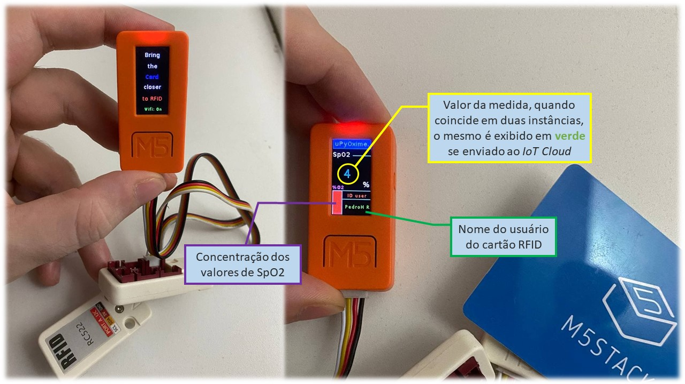
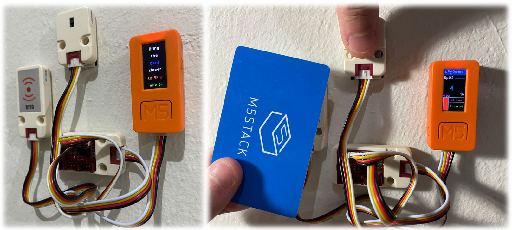

## uPyPulseOximeter-[M5StickC](https://docs.m5stack.com/#/en/core/m5stickc) + [MAX30100 Heart Rate Oxygen Pulse Unit](https://docs.m5stack.com/#/en/unit/heart)

**Configuração para saúde dos pesquisadores do LabNerds:  medição de saturação de oxigênio no sangue, SpO2, e de pulsação**, que permite ver se tais dados da pessoa estão dentro dos valores recomendados, com envio dos dados via WiFi p/ IoT Cloud e exibição resumida dos dados na tela do M5StickC.

Usa **modo de operação contínua dos sensores**, sem deepsleep, com monitoramento dos dados a cada fração de segundo ou poucos segundos, fazendo as medições em função do tempo para serem analisadas via processamento de sinais.

Opções:

- datalogging resumido na memória flash interna;
- medição inteligente do sensor MAX30100 com Edge Computing via módulo ulab, com medição de SpO2 e pulsação, enviando para IoT Cloud somente o resumo das medições de pessoas;
- units/placas externas, como [**Mini RFID MFRC522 Unit**](https://docs.m5stack.com/#/en/unit/rfid) para identificar o usuário (previamente cadastrado), etc.

### Requisitos para programação no M5StickC
Sair do modo Internet (default) no M5StickC, basta:

* lembrando que o botão lateral esquerdo apertado por 1s serve p/ ligar, por 5s para desligar;
* precisa apertar o botão A (frontal, grande, em que está escrito "M5") durante os primeiros 1-2s do boot;
* aí aparece menu com tela "</> Code" em azul claro, use botão lateral direito para chegar na tela "Setup", selecionando com o botão frontal;
* selecione o submenu (pequeno) "Switch mode" com botão frontal, depois use botão lateral direito para chegar em "App", selecionando com o botão frontal, aí suba com o botão lateral direito e selecione "..." com o botão frontal;
* use o botão lateral direito para descer em "Reboot", selecionando com o botão frontal;
* pronto, no modo "App" foi selecionado e em cada (re)boot os arquivos "boot.py" e "main.py" em "/flash" serão executados;

Em seguida, no Thonny, configure:

* selecione o menu `Executar` -> `Selecionar Interpretador` -> `MicroPython (ESP32)` / ou / -> `"MicroPython (genérico)" e Porta` -> `M5Stack InTf (/dev/ttyUSB0)` para reconhecer o M5StickC.

#### Recomendações:

* Caso queira colocar um módulo MicroPython .py na flash interna do M5StickC, utilize o gerenciador de arquivos do thonny (o gerenciador do UIFlow não grava os arquivos com êxito);
* Para aplicações repl, utilize thonny;
* Para executar o código main.py (compilação), utilize UIFlow-Desktop-ide (o thonny por algum motivo não executa o arquivo main.py).

### Informações do Hardware

Os hardware utilizados e necessários para o funcionamento do software foram:

* [**M5StickC**](https://docs.m5stack.com/en/core/m5stickc) (MicroPython v1.12 com UIFlow 1.8.0);
* M5Stack [**Pa.HUB**](https://shop.m5stack.com/collections/m5-sensor/products/pahub-unit) (ligado a porta grove 0);
* Sensor M5Stack [**RFID** Reader/Writer Unit (MFRC522)](https://shop.m5stack.com/collections/m5-sensor/products/rfid-sensor-unit);
* Cards [13.56MHz RFID **Card-F08** Chip](https://shop.m5stack.com/products/13-56mhz-rfid-card-f08-chip-5pcs?_pos=1&_sid=dc186d385&_ss=r);
* Sensor M5Stack [Mini **Heart Rate Unit** (MAX30100) Pulse Oximeter](https://shop.m5stack.com/collections/m5-sensor/products/mini-heart-unit).

**Imagens (V0.3):**

### uPyPulseOximeter IoT

1) **uPyPulseOx_IoT-M5C_V0.1** Os códigos-fonte uPyPulseOx_IoT-M5C, possuem funções mais complexas e recursos extras, na **versão 0.1** (05/08/2021):

* Após a pessoa se identificar com o cartão no RFID, o mesmo deve colocar o dedo no unit HEART (por enquanto substituído pelas leituras do giroscópio);
* Ele grava em uma variável o ID do cartão e mede a taxa de oxigênio em duas instâncias;
    * A primeira medida é feita com um arredondamento da média de 10 valores lidos, em seguida o dispositivo espera 2 segundos;
    * Após os 2 segundos ele afere novamente com o mesmo método.
* Se as medidas possuírem o mesmo valor, tal valor de SpO2 é exibido em verde na tela e enviado para o [**dashboard do Thingspeak**](https://thingspeak.com/channels/1367388), caso o mesmo ocorra, porém sem conexão WiFi no local, o valor de SpO2 é exibido em vermelho;
Caso os valores sejam diferentes, o mesmo não envia e exibe um background vermelho voltando a exigir o cartão ID.

2) **uPyPulseOx_IoT-M5C_V0.2** Os códigos-fonte uPyPulseOx_IoT-M5C, possuem funções mais complexas e recursos extras, na **versão 0.2** (14/08/2021):

* Após a pessoa se identificar com o cartão no RFID, o mesmo deve colocar o dedo no unit HEART (por enquanto substituído pelas leituras do giroscópio);
* Ele grava em uma variável o ID do cartão e exibe na tela, abaixo da taxa de Oxigenação, o nome da pessoa associada;
* Mede a taxa de oxigênio em duas instâncias;
    * A primeira medida é feita com um arredondamento da média de 10 valores lidos, em seguida o dispositivo espera 2 segundos;
    * Após os 2 segundos ele afere novamente com o mesmo método.
* Se as medidas possuírem o mesmo valor, tal valor de SpO2 é exibido em verde na tela e enviado para o [**dashboard do Cayenne**](https://cayenne.mydevices.com/cayenne/dashboard/device/121cb950-fbca-11eb-ab96-c3c008d35c1c), caso o mesmo ocorra, porém sem conexão WiFi no local ou IoT Cloud inacessível, o valor de SpO2 é exibido em vermelho;
Caso os valores sejam diferentes, o mesmo não envia e exibe um background vermelho voltando a exigir o cartão ID.

3) **uPyPulseOx_IoT-M5C_V0.3** Os códigos-fonte uPyPulseOx_IoT-M5C, possuem as mesmas funções e recursos na **versão 0.2**, exceto pelo log das medidas (25/09/2021):

* Mantem todas as funções da segunda versão (V0.2), com a adição de um arquivo `log.txt` que mostra a quantidade de medidas feitas no dia antes da interrupção do protótipo.

##### última versão testada: uPyPulseOx_IoT-M5C_V0.3

Quantidades a serem implementadas:

- total de 1x, pois atende a demanda de usuários do LabNerds;
- 1x na sala de entrada.

**Equipe**: Eduardo Destefani Stefanato e Roberto Colistete Júnior.
